# POOM SDK
This repository contains everything required to produce a DOOM-like using PICO8, featuring:
* Complex geometry (slanted walls, stairs, doors, elevators...)
* Textured floors & walls (inc. animated triggers & textures)
* Lightning (blinking sectors, light triggers)
* 8 sided sprites for monsters & props
* Data driven monsters & props
* Triggers (opening/closing doors, elevators, light...)
* Keys
* Multiple weapons (bullets & projectiles)

Level building and monster logic uses standard DOOM concepts & editors and is fully modable.

>note: the toolkit is NOT a 100% complete DOOM port - many features are not supported (and never will be).

>note: this documentation is using [Slade3](https://slade.mancubus.net/)

>note: the game does not require an official DOOM WAD

# Credits

Original assets - Id Software (Microsoft)

ZDoom Wiki (outstanding content folks!)

# Getting Started
## Pre-Requisites

* [PICO8](ttps://www.lexaloffle.com/pico-8.php) to run game
* [Python 3.6+](https://www.python.org/) to pack levels into pico8 carts
* [Slade 3](https://slade.mancubus.net/) to edit levels
* [ZBSP](https://zdoom.org/files/utils/zdbsp/zdbsp-1.19.zip) to produce UDMF files from levels

## Install Toolchain
1. Clone repo
2. Open a Python command prompt at repo location
3. (optional) Create a Python virtual env:
    ```shell
    python -m venv env
    sandbox/script/activate
    ```
4. Install WAD compiler:
    ```shell
    pip install tools/wad_reader-<latest version>.tar.gz
    ```
5. Validate install
    ```shell
    python -m wad_reader --help
    ```
    Expected output:
    ```shell
    usage: wad_reader.py [-h] --pico-home PICO_HOME --carts-path CARTS_PATH --mod-name MOD_NAME [--map MAP] [--compress] [--release RELEASE]

    optional arguments:
      -h, --help            show this help message and exit
      --pico-home PICO_HOME
                            Full path to PICO8 folder
      --carts-path CARTS_PATH
                            Path to carts folder where game is exported
      --mod-name MOD_NAME   Game cart name (ex: poom)
      --map MAP             Map name to compile (ex: E1M1)
      --compress            Enable compression (default: false)
      --compress-more       Enable adaptative compression (default: false)
      --release RELEASE     Generate packages (bin+html) with given version
      --sky SKY             Skybox texture name
      --dump-sprites        Writes all sprites to a single image with their 16x16 tile overlay.
      ```

## Compile & Run Poom
1. Open a Python command prompt at repo location (e.g. where DECORATE file is)
2. (optional) Enable Python virtual env
3. Generate a PICO8 multi-cart game with a sample level in carts folder:

```shell
python -m wad_reader --pico-home <path to PICO8> --carts-path <path to carts folder> --mod-name <mod name> --map E1M1
```
Example:
```shell
cd poom-sdk
python -m wad_reader --pico-home d:\pico-8_0.2.0 --carts-path carts --mod-name poom --map E1M1
```

4. Launch game:
```shell
pico8 -home <path to repo> poom.p8
```

# Controls

## Player 1 keys

⬇️⬆️: back/forward

⬅️➡️: turn left/right

🅾️ + ⬅️➡️: strafe

❎: fire

## Player 1 + 2 keys

> use keyconfig to map second player keys

WASD or local variant: back/forward/strafe

⬅️➡️: turn left/right

❎: fire

## Weapon Selection

pause: open weapon selection wheel

pause: regular pico-8 pause menu

⬇️⬆️⬅️➡️: select weapon

# Make a Game!
## Level Building

The toolkit supports file-based DOOM archive only.

Archive structure:
* :file_folder: maps/ contains levels WAD files
* :file_folder: graphics/ contains image assets (inc. menu)
* :page_facing_up: PLAYPAL game palette ramp
* :page_facing_up: PAINPAL pain palette ramp
* :page_facing_up: DECORATE define actors & behaviors
* :page_facing_up: TEXTURES defines floor & wall textures
* :page_facing_up: ZMAPINFO defines map options & sequence

### My First Level

Open poom-sdk level folder:

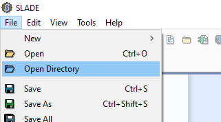

Open the maps folder from Slade:


Create a new map (say E1M3) using UDMF format.
> maps must be named ExMx


Set the base archive to POOM (to use main game resources)


From the map editor, select the "Draw Shape" option (defaults to rectangle), create a new room:

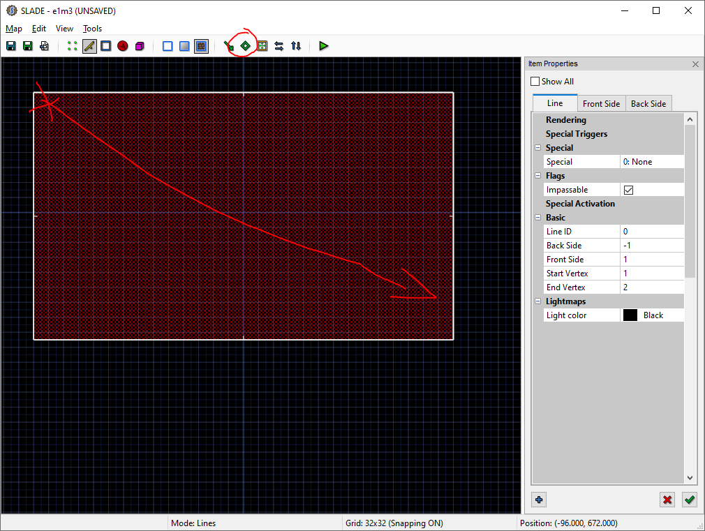

Select all four walls and assign "middle" texture:


Switch to sector mode and assign floor and ceiling textures:


Check level using 3d view:


Save level under: _repo location_/maps

Slade3 will display the settings window to get ZBSP compiler path. This is a good time to fill it with your own path:


Switch to "Things" mode to set player's starting location. Right click inside the room:

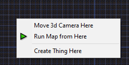

Edit thing type (should not be necessary as first thing created by Slade is player's location):


Select thing ID 1 (e.g. POOM guy!):

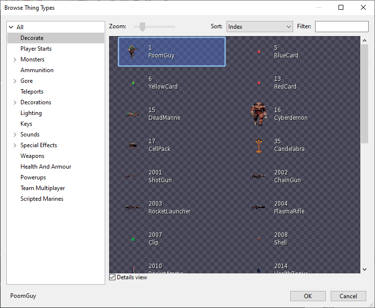

## Sector Specials

The following sector "special" behaviors are supported:

| ID | Type | Description |
|----|:----:|:-----------:|
| 65 | Light Flicker | Random light flicker |
| 69 | 10 Damage | 10 HP every 15 ticks |
| 71 | 5 Damage | 5 HP every 15 ticks |
| 80 | 20 Damage | 20 HP every 15 ticks |
| 84 | 5 Damage + Scroll East | 5 HP every 15 ticks + floor texture scrolling |
| 115 | Instadeath | Kills any actor touching sector floor |
| 195 | Hidden | Defines a secret sector. Will display "secret found" message first time player enters sector |

## Line Specials

The following triggers are supported:
| ID | Type | Description |
|----|:----:|:----------:|
| 10 | Door Close | Lowers the ceiling of all affected sectors to the floor. See: [Door_Close](https://zdoom.org/wiki/Door_Close) |
| 11 | Door Open | Raises the ceiling of all affected sectors to four units below the lowest surrounding ceiling. See: [Door_Open](https://zdoom.org/wiki/Door_Open) |
| 12 | Door Raise | Raises the ceiling of all affected sectors to four units below the lowest surrounding ceiling. After the door is opened, it will be closed again after delay tics. See: [Door_Raise](https://zdoom.org/wiki/Door_Raise) |
| 13 | Door Close | Raises the ceiling of all affected sectors to four units below the lowest surrounding ceiling if the player has the proper key. After the door is opened, it will be closed again after delay tics. See: [Door_LockedRaise](https://zdoom.org/wiki/Door_LockedRaise) |
| 62 | Platform Down/Stay/Up | Lowers a platform, waits, and then raises it back to its original position. See: [Plat_DownWaitUpStay](https://zdoom.org/wiki/Plat_DownWaitUpStay) |
| 64 | Platform Up/Down/Stay | Lower/raise sector floor. See: [Platform Up/Down/Stay](https://zdoom.org/wiki/Plat_UpWaitDownStay) |
| 112 | Light Change | Set sector light. See: [Light Change To Value](https://zdoom.org/wiki/Light_ChangeToValue)

> specials 11/12/13 support an additional trigger delay parameter. Useful to time door close/opening after a fixed time.

> lighttag property is not supported

### Animated Triggers

# Graphics

## Flats
All wall & floors textures (aka "flats") must be stored as single image. The tileset can be up to 1024x256 pixels. This is plenty of room to compose many diverse panels.

The toolkit automatically converts tileset into unique 8x8 tiles. 
> The tileset cannot contain more than 128 unique tiles.

Example tileset:

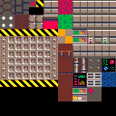

"None" texture ("-") for ceiling & floors will be displayed using a skybox gradient (or pure black if none).

A skybox gradient must be a 2 pixel wide image (up to 128 pixel width).

Example: 


In-game result:

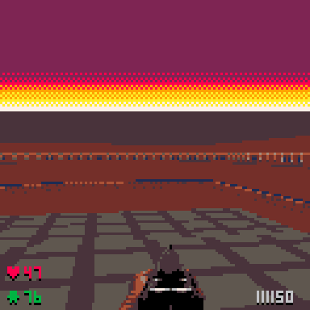

### Creating New Textures

Edit the tileset picture using your favorite paint program. Make sure to use *only* colors from the game palette, save file.

You can have multiple tilesets (one per map group) but sharing textures between tilesets is not supported. It is recommended to prefix texture names with map group name to avoid confusion. 

Example:

    E1_WALL

From Slade, launch the texture editor:

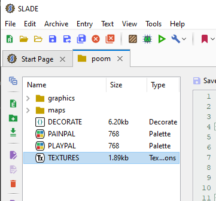

Create a new texture:

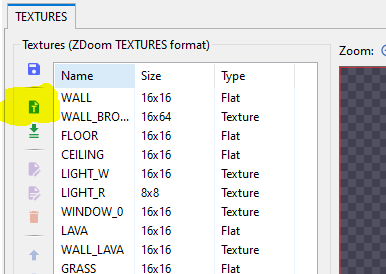

Specify texture name (to be used in editor) and size (in pixels):

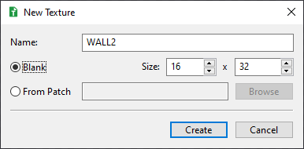

Attach a patch (e.g. source image) to the texture:

> make sure to use the full path option to locate the tileset

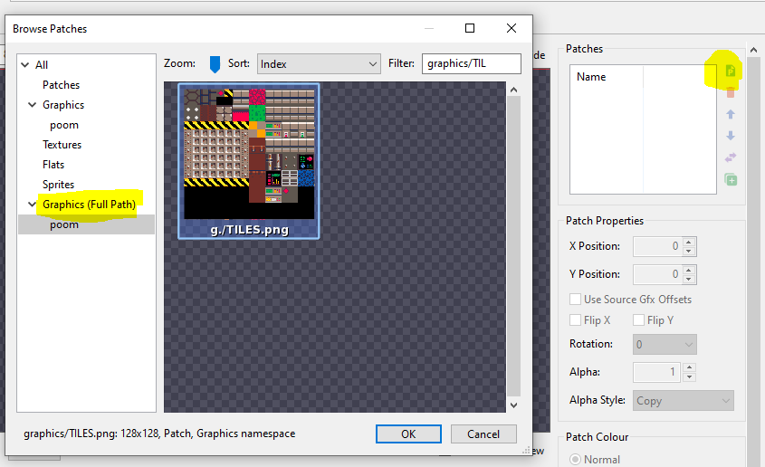

Move the texture area over the correct patch location:

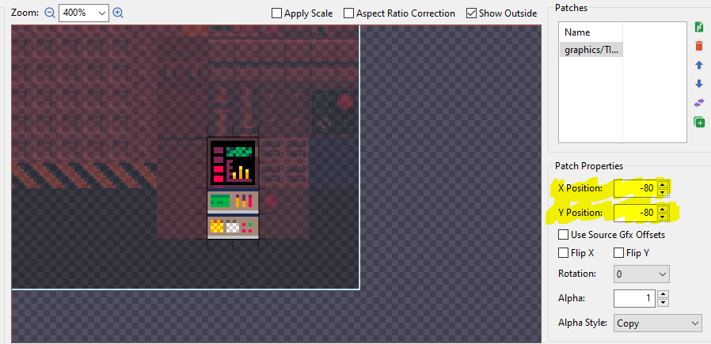

> Adjust texture scale to 0.5/0.5 to match in-game scale.

Save.

The texture is now available in level editor!

### Texture Switches

Line triggers (ex: open door button) will automatically switch between textures named xxx_ON/xxx_OFF

## Palettes

The game support 2 palettes:
* Game palette - used to shade textures & things
* Pain palette - used to fade to red screen when player gets hit

### Game Palette

Must be a 16x16 image using *only* colors from row 0 of pain palette.

Default palette:


### Pain Palette

Must be a 16x16 image - can use any PICO8 colors (inc. secret colors).

Default palette:


Column 0 is the game palette.

> Tip: use @Kometbomb [Fade Generator](http://kometbomb.net/pico8/fadegen.html) to produce pain palette!


## Game Title

Game title is packaged from graphics/m_title.png image.


> Image must be 128x32

> Image must use standard PICO8 palette

# Maps

The ZMAPINFO file contains the list of map metadata (name, music...).

The file syntax is:
```
map <maplump> <nice name> { properties }
gameinfo { properties }
```
where supported *map* properties are:
| property | Type | Description |
|----------|:----:|:-----------:|
|levelnum  | integer | level sequence. Only required to mark first level |
|next | string | lump name of next level. Use ```"endgame"``` to move to game over screen|
|music | integer | (optional) background music identifier. See [Music & Sound]() section |
|sky1 | string | skybox gradient image name. Required if level has "none" ceiling textures. |
|location | integer,integer | (optional) Map marker location (pixels) on loading map |

where supported *gameinfo* properties are:
| property | Type | Description |
|----------|:----:|:-----------:|
|credits  | string | Comma-separated credits, displayed on end game screen. |

Example:
```C
map E1M1 "Hangar"
{
	levelnum = 1
	next = "E1M2"
	music = 0
  location = 35,85
}

map E1M2 "Docks"
{
  // optional
	levelnum = 2
	next = "endgame"
	music = 12
  // references a graphics/SKY.png file
  sky1 = "SKY"
}

gameinfo {
  // pico8 casing is "reversed"
  credits = "cONTRIBUTORS:,jOE,bOB,lOUISE,..."
}
```


# Monsters & Props

The DECORATE file describes everything the player will find in the game (monsters, keys, medkits, props...). Each entry is an **actor**. An actor on the map is a **thing** (e.g. a thing always references an actor).

## Syntax
```C
actor classname [ : parentclassname] [doomednum]
{
  properties
  flags
  states
}
```

Example: light pole
```C
actor Column 2028
{
 Radius 16
 Height 30
 +SOLID
 States
 {
	Spawn:
	 LIGH A -1
	 Stop
 }
}
```

* classname

  The name this new actor is referenced by in the game. While ZDoom will accept a much larger range of values for the name, this should for best compatibility be a valid identifier (alphanumeric plus underscores, but not starting with a digit).
* parentclassname

  The name of a parent class this new actor inherits its attributes from (optional). If none is specified, the parent class is Actor.
  
* doomednum

  Editor number for this actor (optional). This is the number used to distinguish the actor from other things in map. If the actor is intended to be placed in a map editor, it should have an editor number. The actual number value is generally arbitrary but should avoid conflicting with already used numbers.

An actor definition consists of properties, flags and state definitions. In the state definitions you can call Action functions.

Actor properties and flags define the general behavior of an actor.

States define the various sprite animations of an actor.

Action functions (also known as "code pointers") cause the actor to perform some particular action when the frame that calls them is shown. They form the basis of almost all enemy and weapon behavior in the game. Instead of using one of the special action functions you can also use almost any action special that is available in ACS.

Comments are supported. Both types of C-style comments (// to end of line, and /* to */) are allowed. While not part of the specification, certain editing tools, such as Doom Builder and SLADE 3, make use of specific comments for special purposes, these usually start with //$.

## Standard Classes

The following actors are built-in parent class names:

### key
```
actor key {
    amount 1
    maxamount 1
    radius 20
  }
```
### ammo
```
actor ammo {
    radius 20
  }
```
### health
```
actor health {
    maxamount 200
    radius 20
  }
```
### armor
```
actor ammo {
    maxamount 200
    radius 20
  }
```
### weapon
```
actor weapon {
    radius 20
    amount 0
    maxamount 1
  }
```

### player
```
actor PlayerPawn {
    radius 32
    armor 100
    health 100
    speed 3
    +SHOOTABLE
    +SOLID
    +DROPOFF
  }
```
### monster
```
actor Monster {
    radius 20
    armor 0
    health 50
    +SHOOTABLE
    +SOLID
  }
```
### projectile
```
actor Projectile {
    damage 1
    speed 5
    +NOGRAVITY
    +DROPOFF
    +MISSILE
  }
```

## Actor Properties

The following properties can be set in an actor's DECORATE {} block definition. They control various characteristics of your actor, from appearance to behavior or the actor's physical properties. To use, simply specify the property and any associated values on its own line within the actor's definition and outside the state block. 

Supported properties:

### Health _value_
Defines the health a monster or any other shootable item starts with.

Default is 1000.

### Armor _amount_
The amount of armor that this item gives.

### Height _value_
Defines the height of this actor.

Default is 16.

> using very small values can provoke glitches in collision detection.

### Radius _value_
Defines the radius of this actor.

Default is 20.

> Notes:
Using very small values can provoke glitches in collision detection.
The total diameter is double this value, so an actor with a radius of 64 is actually 128 units in length and width, making it impossible for them to navigate through a corridor that's 128 units wide, for example.

### Inventory.Amount _value_
Sets the amount of inventory items given by this item. Mostly used for item types that give larger quantities.

### Inventory.MaxAmount _value_
Sets the maximum amount the player can carry of this item.

### Damage value

For a projectile defines the damage it inflicts upon impact. The formula is random(1,8) * damage.

Default is 0.

### Speed _value_
Defines how fast an actor moves. For projectiles this is the distance it moves per tic (1/35 seconds). For monsters it defines the size of one step done in A_Chase. 

Default is 0.

### Weapon.SlotNumber _value_
Default slot for this weapon. Must be between 1-5.

### Weapon.AmmoGive _amount_
The amount of primary ammo you receive from this weapon.

### Weapon.AmmoUse _amount_
The amount of primary ammo the weapon uses per shot.

### Weapon.HUDLabel _name_
The weapon name as displayed in the weapon selection wheel/hud.

### Inventory.Icon _sprite_
Defines the icon this item uses when displayed in the HUD or status bar.

_sprite_ is the Pico-8 character code (as given by ord())

### Inventory.HUDColor _color_
Defines the icon color (from game palette) this item uses when displayed in the HUD or status bar.

### AttackSound _sound_
Defines the sound the actor makes when attacking.

_sound_ is the sfx id from the user supplied music cart.

### Inventory.PickupSound _sound_
Defines the sound that is played when a player picks up this item.

_sound_ is the sfx id from the user supplied music cart.

### DeathSound _sound_
Defines the sound the actor makes when dying or when a projectile explodes. For non-projectiles the death sound must be explicitly played with A_Scream.

_sound_ is the sfx id from the user supplied music cart.

### MeleeRange _value_
Specifies the maximum distance to a target where a melee attack inflicts damage. Distance is calculated from the attacker's center to the target's center.

Default is 64.

### MaxTargetRange _value_
A monster with this property set will not attack its target unless it is within the specified range. This is used by A_Chase and similar functions.

### Weapon.AmmoType _type_
The type of primary ammo the weapon uses. This must be a valid ammo type.

### Player.StartItem _classname_ [_amount_]
Adds an item to player's start inventory. First weapon added is the weapon selected at start.

> The initial startitem list is never inherited and must be specified in full for each player class.

### TrailType _classname_
Specifies the actor _classname_ to spawn at last thing position every frame. Example use: rocket trail.

## Actor Flags

Flags control various characteristics of your actor, varying from appearance to physical properties. To use, simply specify the flag within the actor's DECORATE definition and outside the state block. You can set or clear a flag as follows:

+FLAGNAME sets a flag
-FLAGNAME clears a flag

Supported flags:

### SOLID

Set when the object should be solid (blocking). The size of the blocking is defined using the height and radius properties.
> Automatically given by the Monster class

### SHOOTABLE

Object can be damaged. If health goes below 0 it enters its death state.
> Automatically given by the Monster class

### FLOAT

Floating actor that can change height at will (usually used for monsters). Actors will not be able to float properly unless it has NOGRAVITY set.

### NOGRAVITY

Actor is not subject to gravity.

### DONTFALL

Doesn't fall down after being killed.

### DROPOFF

Actor can walk over ledges/taller steps.

> Automatically given by the Projectile class

### ISMONSTER

Actor is classed as a monster.

> Automatically given by the Monster class

### MISSILE
Actor is a projectile. Actors with this flag set will enter their death state when hitting a solid and constantly move at their speed value (without the need of any actor functions) 

Actors with this flag will also be able to go through impassable linedefs.

> Automatically given by the Projectile class

### RANDOMIZE
Adds 0-3 tics on first actor's state tick duration. Useful to randomize special effects (puff) or ensure animated sprites are not all in sync.

### COUNTKILL
Counts toward kill percentage.

> Automatically given by the Monster class

### NOSECTORDMG

Ignores sector damage (except insta-kill sectors).

### NOBLOOD

Actor does not bleed when hurt.

## Actor states

An actor's states can be defined within its DECORATE definition. State sequences describe all the behavior of the actor as well as its animation.

### Usage
A state definition is started with the states keyword and enclosed by braces '{', '}'.

It consists of the following:

### State labels
A state label is an identifier followed by a colon (:). State labels give names to state sequences which can then be initiated or checked for using those names.

A state label can be any alphanumeric string (within reason) and is not case sensitive. Some labels (Spawn, See, Death, Ready, Select, Deselect, Fire, etc.) are assumed to exist by the engine for certain actors.

A single state can have several labels, each on a different line. However, most states do not have a label, instead they merely follow other states in sequences.

### State definitions
The main elements of any given state are the following:

1. Its sprite name
1. Its frame letter
1. Its duration in tics
1. Its associated action function
1. Its successor (the next state in sequence)
1. It also might have additional properties which are expressed through special keywords detailed below.

These consist of a sprite name, a frame letter, the duration in tics and optionally additional keywords and an action function name (code pointer). For example:

    STUF C 5 Bright A_Look

Here, STUF is the sprite name, C is the frame letter, 5 the duration, and A_Look the action function.

The successor is defined implicitly as the next defined state, unless a goto, loop, wait, or stop keyword is used to explicitly change it. For instance:

    STUF C 5 Bright A_Look
    STUF D 5 Bright

Here, the successor for the first state is the second state. The second state's successor is not defined in this example.

When the duration runs out, the actor moves to the next state in the sequence and runs the new state's action function immediately. Note that setting -1 as a duration means infinite duration. The actor, once it enters this state, will never leave it on its own; though it can still be moved to a different state by external actions (e.g., suffering damage might put it in the Pain state).

The next state is automatically implied to be the following letter on a frame sequence, or if there aren't any more states on a line, the states defined in the next line. Alternatively, flow control keywords (loop, wait, goto, stop) listed after a state can change it.

### State keywords
The existing keywords can be used in a state between the duration and the action function call.

#### Bright

The sprite will be displayed as fullbright while the actor is in this state.

### Flow control
There are 5 different instructions that control the execution order of an actor's frames directly:

#### loop
Jumps to the most recently defined state label. This is used for a looping animation. Do not put a loop on a state with a duration of -1, this is unnecessary and can cause problems.

#### stop
Stops animating this actor. Normally this is used at the end of the death sequences. If the last state has a duration > -1 the actor will be removed. Note that if a state contains only the stop instruction, the actor will behave as if it doesn't have that state. This can be useful, for example, to remove a state that an actor has inherited from its parent.

#### goto label
Jumps to an arbitrary state in the current actor.

Important note
This format has been designed for maximum flexibility. As a result no assumptions are made about what the designer wants. States are never implicitly created.

Also, if no flow control is used Poom will continue to the state provided directly after. Consecutive state labels can be used to assign the same frames to more than one state.

### States
These are the predefined states each actor has access to:

#### Spawn
Defines the state that is displayed when an actor is spawned. For monsters this is normally also the idle loop.
> Note: An actor that has just been spawned does not run the codepointer from its first “Spawn” frame. An example of this behavior in the original games is ArchvileFire. It will be called, however, if the actor loops or returns to its Spawn state later. An easy workaround to have actors call a codepointer immediately after spawning consists in having the very first frame have a duration of 0 tics, followed by another frame in which the codepointer instruction is given. Another solution is to use the NoDelay keyword.

#### See
Defines the walking animation for a monster. Note that this state must be present for actors which are able to chase and attack other actors.
#### Melee
Defines the melee (near) attack.
#### Missile
Defines the missile (far) attack.
#### Pain
Defines the pain action. Multiple Pain states can be used depending on the type of damage inflicted. See custom damage types.
#### Death
Defines the normal death sequence. Multiple Death states can be used depending on the type of damage that kills the actor. See custom damage types. Also entered by projectiles when hitting a wall (or an actor as well if the Crash and/or XDeath states are not defined).

### Example
This is an example of a state sequence. The rest of this actor has been removed for readability:

    actor ZombieMan 3004
    {
       ...
       states
       {
       Spawn:
           POSS AB 10 A_Look
           loop
       See:
           POSS A 4 A_Chase
           POSS A 4 A_Chase
           POSS B 4 A_Chase
           POSS B 4 A_Chase
           loop
       Missile:
           POSS E 10 A_FaceTarget
           POSS F 8 A_PosAttack
           POSS E 8
           goto See
       Pain:
           POSS G 3
           POSS G 3 A_Pain
           goto See
       Death:
           POSS H 5
           POSS I 5
           POSS J 5
           POSS K 5
           POSS L -1
           stop
       }
    }

> Note: The first frame of the “Spawn” state, “POSS A 10”, contains a codepointer, A_Look. This codepointer is not called the very first time the zombie is spawned in the map, so it has to wait 10 tics to get into its second frame, “POSS B 10”. From then on, it will call all its codepointers reliably. If it runs out of targets, and since it has no “Idle” state, it will return to its Spawn state where it will call A_Look immediately, even in the A frame.

## Decorate Monster AI functions

### A_FireBullets(_angle spread_horz, angle spread_vert, int numbullets, int damage , string pufftype_)

### A_PlaySound(_sound whattoplay_)

Plays the specified sound.

### A_FireProjectile(_string missiletype_)

Fires a projectile

### A_WeaponReady

A_WeaponReady is responsible for checking the fire keys and weapon changing keys. This function should be called in a weapon's “Ready” state so the weapon can be fired.

### A_Explode(_int damage, int distance_)

Performs an explosive (radius) attack.

### A_FaceTarget([_float turnspeed_])

Changes the calling actor's angle to face its current target. 

### A_Look

Looks for players or other attackable actors in the game. If it finds a target, it enters its “See” state.

### A_Chase

This is the standard monster walking function which has to be used in the walking frames of a monster. Typically, it is used in an actor's "See" state or a custom equivalent. When called, actors usually change their directions to a strict 45 degree angle to give the effect of pursuit. This angle changes based on which direction the target is, no matter if the calling actor can see it or not.

### A_Light(_int intensity_)

Set ambiant light - automatically decays.

### A_MeleeAttack(_int damage, string pufftype_)

Performs a melee attack.

### A_SkullAttack([_int speed_])

The attack of Doom's lost soul. The calling actor charges at its current target. The speed parameter defines the speed of the charge (20 by default).

# Music & Sound

Music and sound is totally modable.
Sound is stored in:
```
carts/music.p8
```
This file can be modified as needed. music+sfx sections will be merged with main gamecart at compile time.

## Reserved Sounds

The following sound effects ID are reserved for game engine use:
- 62: blocked button/door sound
- 63: door & platform open/close


